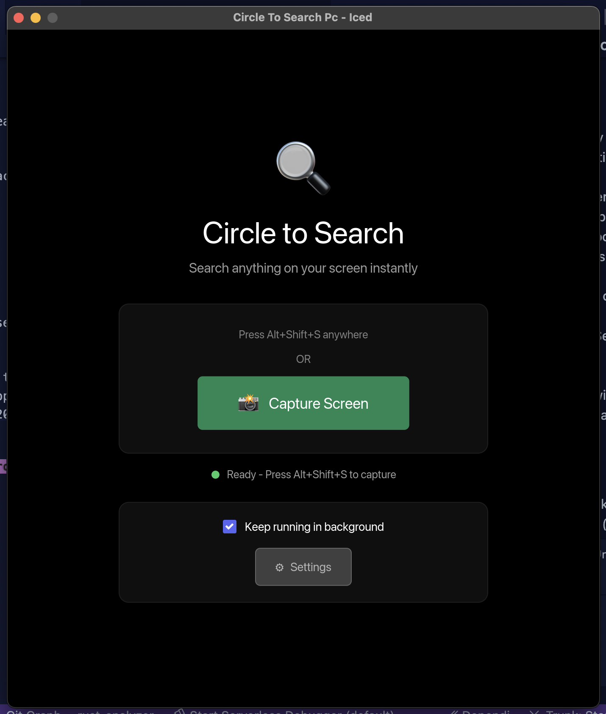
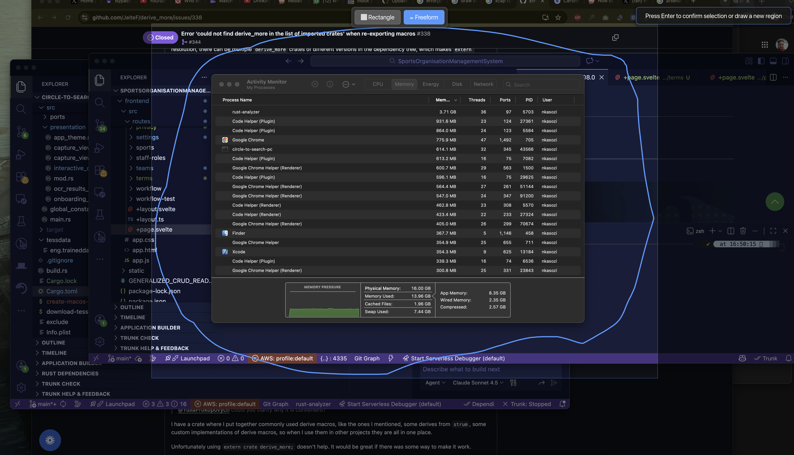
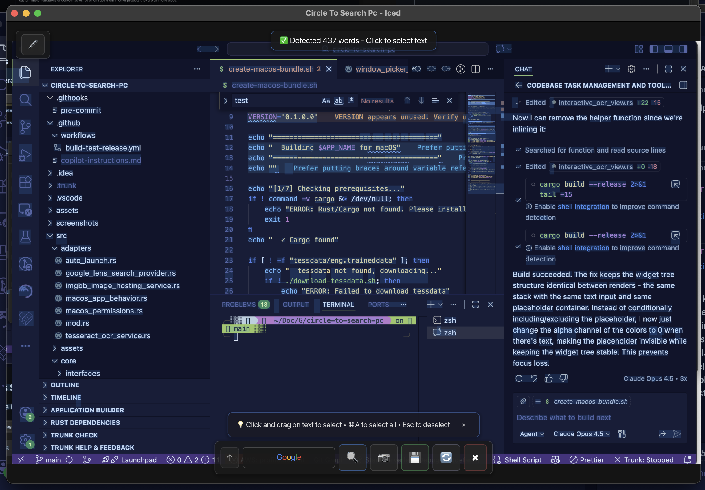
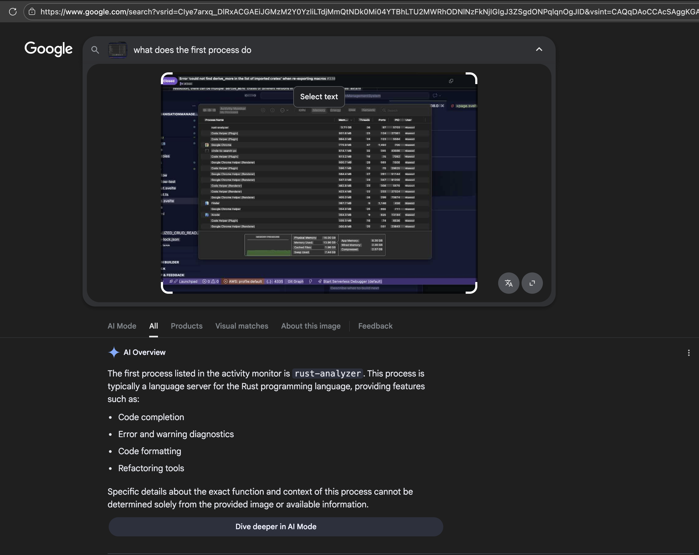
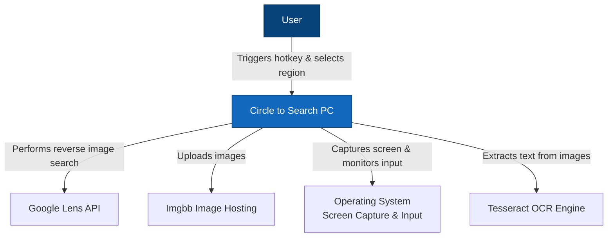

# Circle to Search PC

A desktop application that brings Google Lens-style "Circle to Search" functionality to your PC. Select any region of your screen, extract text using OCR, or perform reverse image searches directly from your desktop.

## The Problem

Modern mobile devices offer convenient visual search capabilities like "Circle to Search" on Android, but desktop users lack similar integrated tools. Users need to:

- Take screenshots manually
- Save them to disk
- Upload to image search services
- Copy and paste text from images

This multi-step process is tedious and breaks workflow concentration.

## The Solution

Circle to Search PC provides:

- **Global Hotkey Activation**: Trigger screen capture from anywhere with a customizable keyboard shortcut
- **Interactive Region Selection**: Click and drag to select any screen area
- **OCR Text Extraction**: Extract text from selected regions using Tesseract OCR
- **Reverse Image Search**: Upload selected regions to perform Google Lens searches
- **Seamless Integration**: Works across all applications without manual file management

## Screenshots

### Main Window
The system tray menu for quick access to app features.



### Freeform Capture
Select any region of your screen with an intuitive click-and-drag interface.



### OCR Results
Extract and interact with text from captured regions.



### Google Lens Search
Perform reverse image searches directly from captured regions.



## Architecture

This application follows **Hexagonal Architecture** (Ports and Adapters pattern) to maintain clean separation between business logic and external dependencies.

### C4 Model - Level 0: System Context



### Key Architectural Patterns

**Hexagonal Architecture Benefits**:

- **Testability**: Core logic isolated from external dependencies, enabling comprehensive unit testing with mocks
- **Flexibility**: Easy to swap implementations (e.g., replace Google Lens with Bing Visual Search)
- **Maintainability**: Clear boundaries between business logic and infrastructure concerns

**Layer Responsibilities**:

| Layer            | Direction  | Purpose                                                         |
| ---------------- | ---------- | --------------------------------------------------------------- |
| **Ports**        | Data IN →  | Things that call the application (keyboard, mouse, system tray) |
| **Adapters**     | Data OUT → | Things the application calls (OCR, image hosting, search APIs)  |
| **Core**         | —          | Pure business logic with no external dependencies               |
| **Presentation** | —          | UI rendering and user interaction                               |

**Port Interfaces** (Data flowing IN):

- `ScreenCapturer`: Abstract screen capture operations
- `MousePositionProvider`: Abstract cursor position tracking
- `KeyboardListener`: Abstract hotkey monitoring

**Adapter Interfaces** (Data flowing OUT):

- `OcrService`: Abstract text extraction from images
- `ReverseImageSearchProvider`: Abstract reverse image search operations
- `ImageHostingService`: Abstract image upload and hosting

**Dependency Injection**: All external dependencies injected as `Arc<dyn Trait>` for runtime polymorphism and testability.

## Getting Started

### Prerequisites

- Rust 1.70 or later
- Tesseract OCR development libraries (for building):
  - **macOS**: `brew install tesseract`
  - **Linux**: `sudo apt install tesseract-ocr libtesseract-dev libleptonica-dev`
  - **Windows**: Download from [GitHub](https://github.com/UB-Mannheim/tesseract/wiki)

**Note**: Release binaries bundle Tesseract data files, so end users don't need to install Tesseract separately.

### Quick Start (macOS)

```bash
git clone https://github.com/nkasozi/circle-to-search-pc.git
cd circle-to-search-pc
./download-tessdata.sh
./create-macos-bundle.sh
cp -r "target/release/Circle to Search.app" /Applications/
```

**First Launch**: macOS Gatekeeper blocks apps that aren't signed with an Apple Developer certificate ($99/year). Since this is an open-source project built from source, you'll need to manually approve it:

1. Right-click (or Control+click) on "Circle to Search" in Applications
2. Select "Open" from the context menu
3. Click "Open" in the warning dialog

After the first launch, it will open normally from Spotlight or Applications.

### Building

First, download the Tesseract language data:

```bash
./download-tessdata.sh
```

Then build:

#### Option 1: Using cargo-bundle (Recommended for macOS)

Install cargo-bundle:

```bash
cargo install cargo-bundle
```

Build and create the app bundle:

```bash
cargo bundle --release
```

The macOS application bundle will be created in `target/release/bundle/osx/Circle to Search.app`.

To install, copy it to Applications:

```bash
cp -r "target/release/bundle/osx/Circle to Search.app" /Applications/
```

#### Option 2: Manual build

```bash
cargo build --release
```

For macOS, create the app bundle manually:

```bash
./create-macos-bundle.sh
```

The application will automatically detect tessdata in the executable directory or use system Tesseract data as fallback.

**Note on Permissions**: On first launch, macOS will prompt for Screen Recording and Accessibility permissions. These are required for:

- **Screen Recording**: To capture your screen for search functionality
- **Accessibility**: To detect the keyboard shortcut (Alt+Shift+S)

The app will guide you through granting these permissions via System Settings.

### Running

```bash
cargo run --release
```

Or use the convenience script:

```bash
./run.sh
```

### Configuration

On first run, the application creates a settings file at:

- **macOS/Linux**: `~/.config/circle-to-search-pc/settings.json`
- **Windows**: `%APPDATA%\circle-to-search-pc\settings.json`

Default settings:

```json
{
  "capture_hotkey": "Ctrl+Shift+D",
  "theme_mode": "Dark",
  "image_search_url_template": "https://lens.google.com/uploadbyurl?url={}"
}
```

## Testing

Run all unit tests:

```bash
cargo test
```

Run specific test module:

```bash
cargo test tesseract_ocr_service
```

Run with output:

```bash
cargo test -- --nocapture
```

### Test Coverage

The application includes 60+ unit tests covering:

- **Core Models**: CaptureBuffer cropping, bounds validation, OCR results, user settings
- **Adapters**: Google Lens search URL construction, Imgbb hosting, Tesseract OCR initialization
- **Ports**: Screen capture conversion, mouse tracking, system tray events
- **Orchestrator**: State management, message handling, settings updates
- **Presentation**: Theme generation, button styling

All external dependencies are mocked for isolated testing. Tests are co-located with source code using `#[cfg(test)]` modules.

## Usage

1. **Launch Application**: Start the application using `cargo run` or the executable
2. **Trigger Capture**: Press the configured hotkey (default: `Ctrl+Shift+D`)
3. **Select Region**: Click and drag to select the screen area
4. **Choose Action**:
   - **Extract Text**: Click "Perform OCR" to extract text from the selection
   - **Search Image**: Click "Search" to perform a reverse image search
5. **View Results**: OCR text appears in the results panel, search opens in your browser

## Technology Stack

- **Language**: Rust
- **GUI Framework**: Iced 0.15
- **Async Runtime**: Tokio
- **OCR**: rusty-tesseract (Tesseract wrapper)
- **Screen Capture**: xcap
- **Image Processing**: image crate
- **HTTP Client**: reqwest
- **Configuration**: serde_json

## Project Structure

The codebase follows **Hexagonal Architecture** (also known as Ports and Adapters or Onion Architecture), organizing code into clear layers with well-defined responsibilities.

```
src/
├── main.rs                              # Application entry point
├── global_constants.rs                  # App-wide configuration constants
│
├── core/                                # CORE DOMAIN LAYER
│   │                                    # Pure business logic, no external dependencies
│   │
│   ├── models/                          # Domain entities and value objects
│   │   ├── capture_buffer.rs            # Screen capture data with cropping logic
│   │   ├── screen_region.rs             # Screen coordinates and regions
│   │   ├── ocr.rs                       # OCR result structures (words, positions)
│   │   └── user_settings.rs             # User preferences and configuration
│   │
│   ├── interfaces/                      # Abstract contracts (traits)
│   │   ├── adapters/                    # Interfaces for OUTGOING dependencies
│   │   │   ├── search_provider.rs       # Reverse image search abstraction
│   │   │   ├── image_hosting_service.rs # Image upload abstraction
│   │   │   └── ocr_service.rs           # Text extraction abstraction
│   │   └── ports/                       # Interfaces for INCOMING data
│   │       ├── screen_capturer.rs       # Screen capture abstraction
│   │       └── mouse_provider.rs        # Mouse position abstraction
│   │
│   └── orchestrators/                   # Application use cases
│       ├── app.rs                       # Main app initialization and lifecycle
│       └── app_orchestrator.rs          # Core workflow orchestration
│
├── ports/                               # PORTS LAYER (Data IN)
│   │                                    # Implementations that DRIVE the application
│   │
│   ├── xcap_screen_capturer.rs          # Screen capture using xcap library
│   ├── mouse_position_provider.rs       # System mouse position tracking
│   ├── keyboard_listener.rs             # Global hotkey monitoring
│   └── system_tray.rs                   # System tray icon and menu events
│
├── adapters/                            # ADAPTERS LAYER (Data OUT)
│   │                                    # Implementations the application DRIVES
│   │
│   ├── tesseract_ocr_service.rs         # Tesseract OCR integration
│   ├── google_lens_search_provider.rs   # Google Lens reverse image search
│   ├── imgbb_image_hosting_service.rs   # Imgbb image upload service
│   ├── auto_launch.rs                   # OS auto-start configuration
│   └── macos_permissions.rs             # macOS permission requests
│
├── presentation/                        # PRESENTATION LAYER
│   │                                    # User interface components
│   │
│   ├── app_theme.rs                     # Visual theming (colors, styles)
│   ├── capture_view.rs                  # Screen region selection overlay
│   ├── interactive_ocr_view.rs          # OCR results with text selection
│   ├── ocr_results_view.rs              # Simple results display
│   └── onboarding_view.rs               # First-run permission setup
│
├── infrastructure/                      # INFRASTRUCTURE LAYER
│   │                                    # Cross-cutting utilities
│   │
│   └── utils.rs                         # Single instance lock, helpers
│
└── assets/                              # STATIC ASSETS
    ├── icon.png                         # Application icon
    ├── icon.icns                        # macOS icon format
    └── tray_icon.png                    # System tray icon
```

### Architecture Quick Reference

| Layer              | Purpose                | Dependencies     | Example                             |
| ------------------ | ---------------------- | ---------------- | ----------------------------------- |
| **Core**           | Business logic & rules | None (pure Rust) | Cropping images, validating regions |
| **Ports**          | External events IN     | Core interfaces  | Keyboard shortcuts, mouse events    |
| **Adapters**       | External services OUT  | Core interfaces  | OCR services, image hosting         |
| **Presentation**   | User interface         | Core models      | Capture overlay, results view       |
| **Infrastructure** | Utilities              | None             | Process management, file I/O        |

### Data Flow

```
[User Input] → Ports → Core Orchestrator → Adapters → [External Services]
     ↓                       ↓
[System Events]        Presentation
                            ↓
                      [User Output]
```

## CI/CD Pipeline

The project uses GitHub Actions for continuous integration and deployment:

### Automated Testing

On every push and pull request to `main`/`master`:

- Builds and tests on Ubuntu (Linux)
- Installs Tesseract and system dependencies
- Runs complete test suite (40+ tests)
- Caches dependencies for faster builds

**Note**: Testing only on Linux saves CI costs. Release builds verify platform compatibility by building natively on each target OS.

### Automated Releases

On version tags (e.g., `v1.0.0`):

- Downloads Tesseract language data (eng.traineddata)
- Builds self-contained release binaries for all platforms
- Creates platform-specific installers with bundled Tesseract data:
  - **Linux**: `circle-to-search-pc-linux-x86_64.AppImage` (portable, includes tessdata)
  - **macOS Intel**: `circle-to-search-pc-macos-x86_64.dmg` (app bundle with tessdata)
  - **macOS Apple Silicon**: `circle-to-search-pc-macos-aarch64.dmg` (app bundle with tessdata)
  - **Windows**: `circle-to-search-pc-windows-x86_64-setup.exe` (installer with tessdata)
- All installers are fully self-contained - no Tesseract installation required
- Automatically creates GitHub release with downloadable installers

### Creating a Release

```bash
git tag v1.0.0
git push origin v1.0.0
```

The CI pipeline will automatically build, test, and publish the release.

## Contributing

Contributions are welcome! The hexagonal architecture makes it easy to:

- **Add new search providers**: Implement `ReverseImageSearchProvider` trait in `adapters/`
- **Add new image hosts**: Implement `ImageHostingService` trait in `adapters/`
- **Add new OCR engines**: Implement `OcrService` trait in `adapters/`
- **Add new input methods**: Implement port interfaces in `ports/`
- **Improve UI**: Modify views in `presentation/`

All business logic changes should go in `core/` with corresponding unit tests.

## Acknowledgments

- Tesseract OCR for text recognition
- Imgbb for image hosting
- The Rust community for excellent libraries
