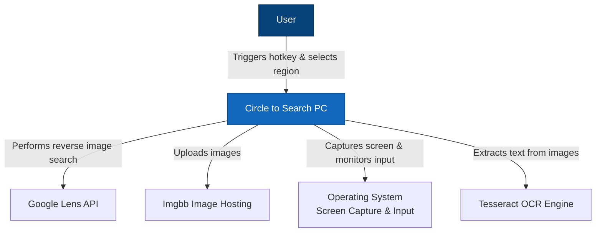

# Circle to Search PC

A desktop application that brings Google Lens-style "Circle to Search" functionality to your PC. Select any region of your screen, extract text using OCR, or perform reverse image searches directly from your desktop.

## The Problem

Modern mobile devices offer convenient visual search capabilities like "Circle to Search" on Android, but desktop users lack similar integrated tools. Users need to:

- Take screenshots manually
- Save them to disk
- Upload to image search services
- Copy and paste text from images

This multi-step process is tedious and breaks workflow concentration.

## The Solution

Circle to Search PC provides:

- **Global Hotkey Activation**: Trigger screen capture from anywhere with a customizable keyboard shortcut
- **Interactive Region Selection**: Click and drag to select any screen area
- **OCR Text Extraction**: Extract text from selected regions using Tesseract OCR
- **Reverse Image Search**: Upload selected regions to perform Google Lens searches
- **Seamless Integration**: Works across all applications without manual file management

## Architecture

This application follows **Hexagonal Architecture** (Ports and Adapters pattern) to maintain clean separation between business logic and external dependencies.

### C4 Model - Level 0: System Context



### C4 Model - Level 1: Container Diagram with Hexagonal Architecture

```mermaid
graph TB
    subgraph External["External Systems"]
        GoogleLens[Google Lens API]
        Imgbb[Imgbb Image Hosting]
        OS[Operating System APIs]
        TesseractEngine[Tesseract OCR Engine]
    end

    subgraph Application["Circle to Search PC"]
        subgraph Core["Core Domain"]
            Models[Models<br/>CaptureBuffer<br/>ScreenRegion<br/>OcrResult]
            Orchestrator[AppOrchestrator<br/>Business Logic & State]

            subgraph Interfaces["Interfaces"]
                PortInterfaces[Port Interfaces<br/>ScreenCapturer<br/>MousePositionProvider<br/>KeyboardListener]
                AdapterInterfaces[Adapter Interfaces<br/>OcrService<br/>ReverseImageSearchProvider<br/>ImageHostingService]
            end
        end

        subgraph Ports["Infrastructure Ports"]
            XcapCapturer[XcapScreenCapturer]
            MouseProvider[SystemMousePositionProvider]
            KeyboardPort[KeyboardListener]
        end

        subgraph Adapters["External Service Adapters"]
            TesseractAdapter[TesseractOcrService]
            GoogleLensAdapter[GoogleLensSearchProvider]
            ImgbbAdapter[ImgbbImageHostingService]
        end

        UI[Iced GUI Framework<br/>Presentation Layer]
    end

    UI -->|Commands| Orchestrator
    Orchestrator -->|Uses| Models
    Orchestrator -->|Depends on| PortInterfaces
    Orchestrator -->|Depends on| AdapterInterfaces

    XcapCapturer -.->|Implements| PortInterfaces
    MouseProvider -.->|Implements| PortInterfaces
    KeyboardPort -.->|Implements| PortInterfaces

    TesseractAdapter -.->|Implements| AdapterInterfaces
    GoogleLensAdapter -.->|Implements| AdapterInterfaces
    ImgbbAdapter -.->|Implements| AdapterInterfaces

    XcapCapturer -->|Uses| OS
    MouseProvider -->|Uses| OS
    KeyboardPort -->|Uses| OS
    TesseractAdapter -->|Uses| TesseractEngine
    GoogleLensAdapter -->|Calls| GoogleLens
    GoogleLensAdapter -->|Depends on| ImgbbAdapter
    ImgbbAdapter -->|Uploads to| Imgbb

    style Core fill:#1168bd,stroke:#0b4884,color:#ffffff
    style Interfaces fill:#2196F3,stroke:#1976D2,color:#ffffff
    style Ports fill:#4CAF50,stroke:#388E3C,color:#ffffff
    style Adapters fill:#FF9800,stroke:#F57C00,color:#ffffff
    style External fill:#9E9E9E,stroke:#616161,color:#ffffff
```



### Key Architectural Patterns

**Hexagonal Architecture Benefits**:

- **Testability**: Core logic isolated from external dependencies, enabling comprehensive unit testing with mocks
- **Flexibility**: Easy to swap implementations (e.g., replace Google Lens with Bing Visual Search)
- **Maintainability**: Clear boundaries between business logic and infrastructure concerns

**Port Interfaces** (Infrastructure):

- `ScreenCapturer`: Abstract screen capture operations
- `MousePositionProvider`: Abstract cursor position tracking
- `KeyboardListener`: Abstract hotkey monitoring

**Adapter Interfaces** (External Services):

- `OcrService`: Abstract text extraction from images
- `ReverseImageSearchProvider`: Abstract reverse image search operations
- `ImageHostingService`: Abstract image upload and hosting

**Dependency Injection**: All external dependencies injected as `Arc<dyn Trait>` for runtime polymorphism and testability.

## Getting Started

### Prerequisites

- Rust 1.70 or later
- Tesseract OCR installed on your system:
  - **macOS**: `brew install tesseract`
  - **Linux**: `sudo apt install tesseract-ocr`
  - **Windows**: Download from [GitHub](https://github.com/UB-Mannheim/tesseract/wiki)

### Building

```bash
cargo build --release
```

### Running

```bash
cargo run --release
```

Or use the convenience script:

```bash
./run.sh
```

### Configuration

On first run, the application creates a settings file at:

- **macOS/Linux**: `~/.config/circle-to-search-pc/settings.json`
- **Windows**: `%APPDATA%\circle-to-search-pc\settings.json`

Default settings:

```json
{
  "capture_hotkey": "Ctrl+Shift+D",
  "theme_mode": "Dark",
  "image_search_url_template": "https://lens.google.com/uploadbyurl?url={}"
}
```

## Testing

Run all unit tests:

```bash
cargo test
```

Run specific test module:

```bash
cargo test tesseract_ocr_service
```

Run with output:

```bash
cargo test -- --nocapture
```

### Test Coverage

The application includes 40+ unit tests covering:

- **Models**: CaptureBuffer cropping, bounds validation, OCR results
- **Adapters**: Google Lens search, Imgbb hosting, Tesseract OCR
- **Ports**: Screen capture, mouse tracking, coordinate conversion
- **Orchestrator**: State management, message handling, service initialization

All external dependencies are mocked for isolated testing.

## Usage

1. **Launch Application**: Start the application using `cargo run` or the executable
2. **Trigger Capture**: Press the configured hotkey (default: `Ctrl+Shift+D`)
3. **Select Region**: Click and drag to select the screen area
4. **Choose Action**:
   - **Extract Text**: Click "Perform OCR" to extract text from the selection
   - **Search Image**: Click "Search" to perform a reverse image search
5. **View Results**: OCR text appears in the results panel, search opens in your browser

## Technology Stack

- **Language**: Rust
- **GUI Framework**: Iced 0.15
- **Async Runtime**: Tokio
- **OCR**: rusty-tesseract (Tesseract wrapper)
- **Screen Capture**: xcap
- **Image Processing**: image crate
- **HTTP Client**: reqwest
- **Configuration**: serde_json

## Project Structure

```
src/
├── main.rs                          # Application entry point
├── app.rs                           # Main application state & initialization
├── app_theme.rs                     # UI theming
├── global_constants.rs              # Configuration constants
├── user_settings.rs                 # Settings management
├── utils.rs                         # Utility functions
├── core/                            # Core domain layer
│   ├── models/                      # Domain models
│   │   ├── capture_buffer.rs        # Screen capture data
│   │   ├── screen_region.rs         # Screen region coordinates
│   │   └── ocr.rs                   # OCR result structures
│   ├── interfaces/                  # Interface definitions
│   │   ├── adapters/                # External service interfaces
│   │   │   ├── search_provider.rs   # Reverse image search abstraction
│   │   │   ├── image_hosting_service.rs  # Image hosting abstraction
│   │   │   └── mod.rs
│   │   └── ports/                   # Infrastructure interfaces
│   │       ├── screen_capturer.rs   # Screen capture abstraction
│   │       ├── mouse_provider.rs    # Mouse tracking abstraction
│   │       └── mod.rs
│   └── orchestrators/               # Business logic orchestration
│       └── app_orchestrator.rs      # Main orchestrator
├── adapters/                        # External service implementations
│   ├── tesseract_ocr_service.rs     # Tesseract OCR adapter
│   ├── google_lens_search_provider.rs  # Google Lens adapter
│   ├── imgbb_image_hosting_service.rs  # Imgbb adapter
│   └── mod.rs
├── ports/                           # Infrastructure implementations
│   ├── xcap_screen_capturer.rs      # Screen capture port
│   ├── mouse_position_provider.rs   # Mouse tracking port
│   ├── keyboard_listener.rs         # Hotkey monitoring port
│   └── mod.rs
└── presentation/                    # UI layer
    ├── capture_view.rs              # Screen capture UI
    ├── interactive_ocr_view.rs      # OCR interaction UI
    ├── ocr_results_view.rs          # Results display UI
    └── mod.rs
```

## CI/CD Pipeline

The project uses GitHub Actions for continuous integration and deployment:

### Automated Testing

On every push and pull request to `main`/`master`:

- Builds on Ubuntu, macOS, and Windows
- Installs Tesseract and system dependencies
- Runs complete test suite (40+ tests)
- Caches dependencies for faster builds

### Automated Releases

On version tags (e.g., `v1.0.0`):

- Builds release binaries for all platforms
- Creates platform-specific installers:
  - **Linux**: `circle-to-search-pc-linux-x86_64.AppImage` (portable, no installation required)
  - **macOS Intel**: `circle-to-search-pc-macos-x86_64.dmg` (drag-and-drop installer)
  - **macOS Apple Silicon**: `circle-to-search-pc-macos-aarch64.dmg` (drag-and-drop installer)
  - **Windows**: `circle-to-search-pc-windows-x86_64-setup.exe` (Inno Setup installer)
- Automatically creates GitHub release with downloadable installers

### Creating a Release

```bash
git tag v1.0.0
git push origin v1.0.0
```

The CI pipeline will automatically build, test, and publish the release.

## Contributing

Contributions are welcome! The hexagonal architecture makes it easy to:

- Add new search providers (implement `ReverseImageSearchProvider`)
- Add new image hosts (implement `ImageHostingService`)
- Add new OCR engines (implement `OcrService`)
- Improve UI components in the presentation layer

## Acknowledgments

- Tesseract OCR for text recognition
- Imgbb for image hosting
- The Rust community for excellent libraries
